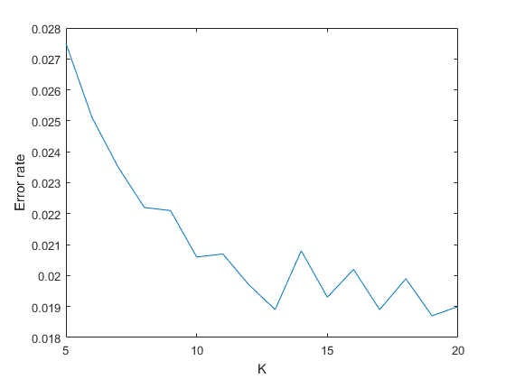
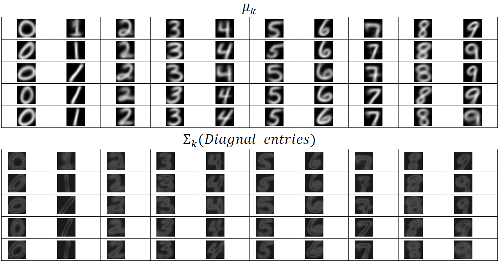
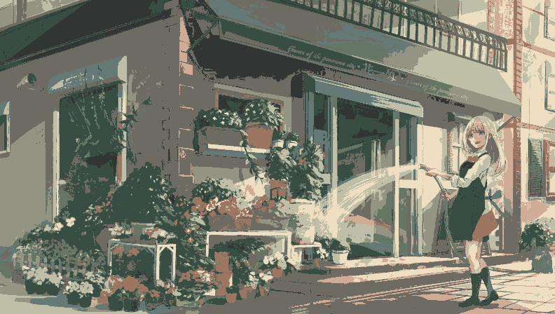

# Mixture of Gaussians for MNIST and Segmentation
I built GMMs(Gaussian Mixture Models) and tested the performance by MNIST data. Constructing 10 GMMs for 10 digits, and used them to do recognition for the test data. After analyzing the GMMs by tuning parameters, I used it to implement the image segmentation.

## MNIST

||
|:--------------------------------------------:|
|Classification error rate for different value of K|

||
|:--------------------------------------------:|
|Visualization of $\mu_k, \Sigma_k$ for each GMM(digit)|

## Segmentation

||
:----------------------------------------:|:----------------------------------------:|:----------------------------------------:
||
Original|K=10|Colormap ($\mu_k$)
